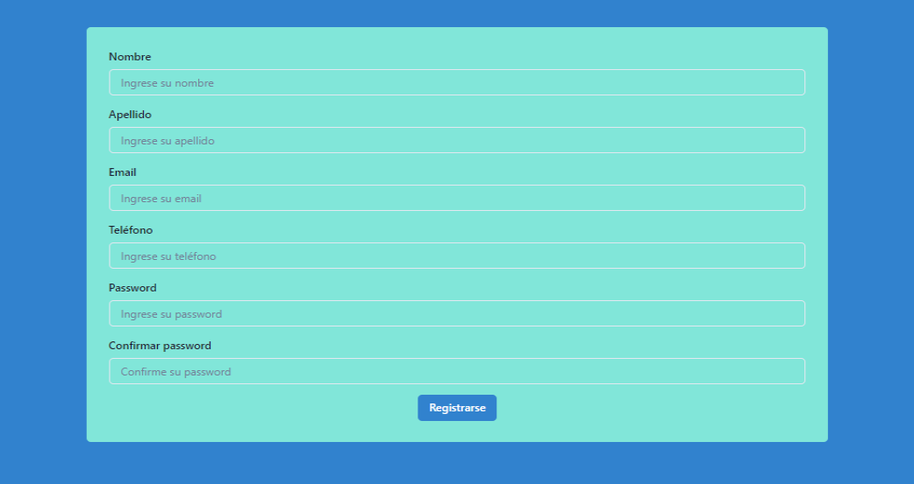

# Registro de página web con React JS, Chakra UI, Formik y Yup

Este proyecto fue desarrollado como parte del programa de UTN y Argentina Programa. El objetivo era crear el maquetado de una página de registro utilizando React JS y JSX, Chakra UI y Formik.



## Requisitos

- Node.js
- npm

## Pasos

1. Abre Visual Studio Code y crea un nuevo proyecto de React JS utilizando el comando `npx create-react-app nombre-del-proyecto` en la terminal.
2. Instala las dependencias de Chakra UI y Formik utilizando los comandos `npm install @chakra-ui/react @emotion/react @emotion/styled framer-motion` y `npm install formik`, respectivamente.
3. En la carpeta `src`, crea un nuevo archivo llamado `Registro.js`.
4. Importa los componentes necesarios de React, Chakra UI y Formik al inicio del archivo:

```jsx
import React from 'react';
import { Box, Button, FormControl, FormErrorMessage, FormLabel, Input, VStack } from '@chakra-ui/react';
import { Formik, Form, Field } from 'formik';
